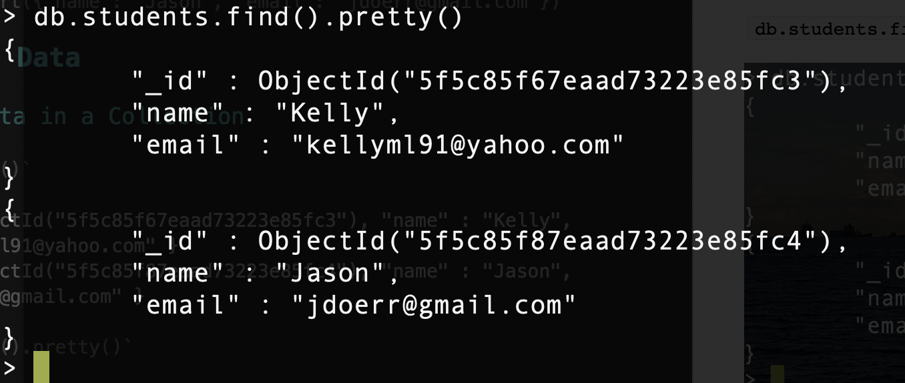

# MongoDB – Getting Started

## You Need:

* Linux or Mac machine
* Docker installed & running
* Terminal Application
* Or simply use the [Google Cloud Shell](https://console.cloud.google.com/home/dashboard?cloudshell=true) (free!)

## 1 – Run MongoDB with Interactive Shell

`git clone https://github.com/u1i/mongodb-getting-started`

`cd mongodb-getting-started`

`./run-mongo.sh`

## 2 – Databases

### Which DB am I using?

`db`

> test

### Which databases exist?

`show databases`

> admin   0.000GB    
> config  0.000GB    
> local   0.000GB

### Switch to (or create) DB

`use class01`

> switched to db class01

## 3 – Create a Collection & Add Data

`db.students.insert({"name": "Kelly", "email": "kellyml91@yahoo.com"})`

`db.students.insert({"name": "Jason", "email": "jdoerr@gmail.com"})`

## 4 – Query Data

### Get All Data in a Collection

`db.students.find()`

> { "\_id" : ObjectId("5f5c85f67eaad73223e85fc3"), "name" : "Kelly", "email" : "kellyml91@yahoo.com" }    
> { "_id" : ObjectId("5f5c85f87eaad73223e85fc4"), "name" : "Jason", "email" : "jdoerr@gmail.com" }

`db.students.find().pretty()`

### Find All Students with the name 'Jason'

`db.students.find({"name": "Jason"})`

> { "_id" : ObjectId("5f5c85f87eaad73223e85fc4"), "name" : "Jason", "email" : "jdoerr@gmail.com" }

## 5 – Deleting Stuff

### Delete a Document

`db.students.remove({"name": "Jason"})`

### Delete a Collection
`db.students.remove({})`